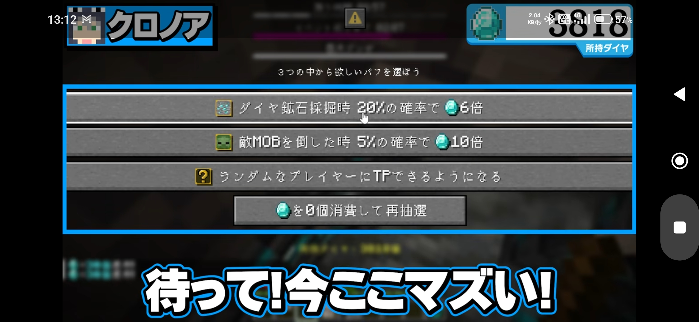

# 02 要件定義書（ドラフト v0.2）

> 工程：要件定義（ウォーターフォール第2工程）
> 入力：[01 要求定義書 v1.0](./01_要求定義書.md)
> 状態：**ヒアリング中**。【案】は私からの提案で、未確定。

要求定義書の「やりたいこと」を、システムとして**何をどう振る舞うか**のレベルまで具体化する。
コマンド名やクラス構成などの「どう作るか」は基本設計で決める。

## 1. ゲームの状態

ゲームは次の4つの状態を持つ。

| 状態 | 説明 | 次の状態へ移る条件 |
|---|---|---|
| 待機中 | ゲームをしていない。管理者が設定できる | 管理者が開始コマンドを実行 → 準備中 |
| 準備中 | 開始前のカウントダウン【案：10秒】 | カウントダウン終了 → プレイ中 |
| プレイ中 | ダイヤ獲得・パーク取得が有効 | 時間切れ／目標達成／管理者の強制終了 → 終了 |
| 終了 | 結果を表示する | 管理者がリセット【案：一定時間後に自動で待機中】 → 待機中 |

## 2. 管理者の操作（R-ADM）

| ID | 要件 |
|---|---|
| R-ADM-01 | 時間制限モードで開始できる（ルール・設定値は別紙「時間制限モード ルール定義書」） |
| R-ADM-02 | 目標個数モードで開始できる（ルール・設定値は別紙「目標個数モード ルール定義書」） |
| R-ADM-03 | プレイ中のゲームを強制終了できる |
| R-ADM-04 | 今いる場所をリスポーン地点として設定できる |
| R-ADM-05 | パーク取得の間隔（3分／5分）を設定できる |
| R-ADM-06 | 管理者以外のプレイヤーは上記の操作ができない |

## 3. 参加者（R-PLY）

| ID | 要件 |
|---|---|
| R-PLY-01 | 開始時にオンラインのプレイヤー全員が参加者になる【案】 |
| R-PLY-02 | ゲーム途中で入ったプレイヤーは観戦者になる【案】 |
| R-PLY-03 | 途中で抜けた参加者のスコアとパークは保持し、戻ったら続きから遊べる【案】 |

## 4. ダイヤ獲得（R-DIA）

| ID | 要件 |
|---|---|
| R-DIA-01 | 参加者がダイヤ鉱石（深層岩ダイヤ鉱石を含む）を壊すと、獲得イベントが起きる |
| R-DIA-02 | ダイヤ鉱石を壊してもアイテムは落ちない【案：経験値は通常どおり落ちる】 |
| R-DIA-03 | 獲得数 = 基本値（1）にパークの効果を適用した値。上限なし |
| R-DIA-04 | 敵（モブ）・プレイヤーを倒したときの獲得は、該当パークを持っている場合のみ起きる |
| R-DIA-05 | 獲得時の演出：効果音＋パーティクル＋画面中央下に「+N ダイヤ」【案】 |
| R-DIA-06 | ダイヤ獲得はプレイ中のみ有効。待機中・終了後は通常のマインクラフトの動作 【案】|

## 5. パーク（R-PRK）

| ID | 要件 |
|---|---|
| R-PRK-01 | プレイ中、設定した間隔（3分／5分）ごとに全参加者がパークを1つ取得する |
| R-PRK-02 | 取得時、ランダムに選んだ**3つの候補**を画面に並べて表示し、参加者が1つを選ぶ（表示イメージは下の参考画像）。一定時間【案：30秒】内に選ばなければランダムで決まる |
| R-PRK-03 | 候補の画面には「再抽選」ボタンがあり、ダイヤを消費して候補を引き直せる【要確認：消費数のルール】 |
| R-PRK-04 | **同じパークは2回出ない**。一度取得したパークは以降の候補に出ない。1回の候補3つも互いに重ならない |
| R-PRK-05 | ゲームの**後半ほどパークの効果量が大きくなる**（例：取得回数が進むほど倍率・確率が上がる）。具体的な増え方はパーク定義書で決める |
| R-PRK-06 | 自分が持っているパークの一覧をいつでも確認できる |
| R-PRK-07 | パークは「系統・名前・説明・発動条件・確率・効果量」を持つデータとして定義し、追加しやすくする |
| R-PRK-08 | 個々のパークの内容は別紙「パーク定義書」で定義する |

参考画像（パーク選択画面のイメージ）：

参考画像から読み取れるパークの形式：「〈きっかけ〉時 〈確率〉%の確率で ダイヤ〈倍率〉倍」（例：ダイヤ鉱石採掘時 20%の確率で6倍、敵MOBを倒した時 5%の確率で10倍）。その他系の例：「ランダムなプレイヤーにTPできるようになる」。

## 6. 画面表示（R-UI）

| ID | 要件 |
|---|---|
| R-UI-01 | 画面右側のスコアボードに、全参加者のダイヤ数を表示する【案】 |
| R-UI-02 | 画面上部のバー（ボスバー）に、残り時間（時間制限モード）または目標個数（目標個数モード）を表示する【案】 |
| R-UI-03 | 次のパーク取得までの残り時間を表示する【案：ボスバー内に一緒に表示】 |
| R-UI-04 | 終了時、全員に順位とダイヤ数を表示する |
| R-UI-05 | 表示はすべて日本語 |

## 7. 勝敗

モードごとにルールが大きく異なるため、別紙で定義する。

- [時間制限モード ルール定義書](./rules/時間制限モード.md)
- [目標個数モード ルール定義書](./rules/目標個数モード.md)

## 8. 死亡・リスポーン（R-RSP）

| ID | 要件 |
|---|---|
| R-RSP-01 | プレイ中に死んだ参加者は、設定したリスポーン地点に復活する |
| R-RSP-02 | 死亡によるスコア・パークの減少はない |
| R-RSP-03 | 持ち物は死んでも失わない（キープインベントリ） |

## 9. 共通の初期値【案】

モード固有の値（制限時間・目標個数など）は各モードのルール定義書で定める。

| 項目 | 初期値 |
|---|---|
| パーク取得の間隔 | 5分 |
| パーク選択の制限時間 | 30秒 |
| 開始カウントダウン | 10秒 |

## 10. 範囲外

- スコアやゲームの状態をサーバー再起動後も保持すること【案】
- 要求定義書の範囲外項目はそのまま引き継ぐ

## 11. 確認したいこと

- **Q6** パーク選択画面の方式（R-PRK-02）：参考画像の形（ボタンが並ぶ画面）を、1.20.1 のバニラクライアントで出す方法がない。対応バージョンを変えるか、1.20.1 で出せる形にするか
- **Q7** 再抽選（R-PRK-03）：入れるか。入れる場合、消費するダイヤ数のルール
- **Q8** 各モードのルール（別紙）
